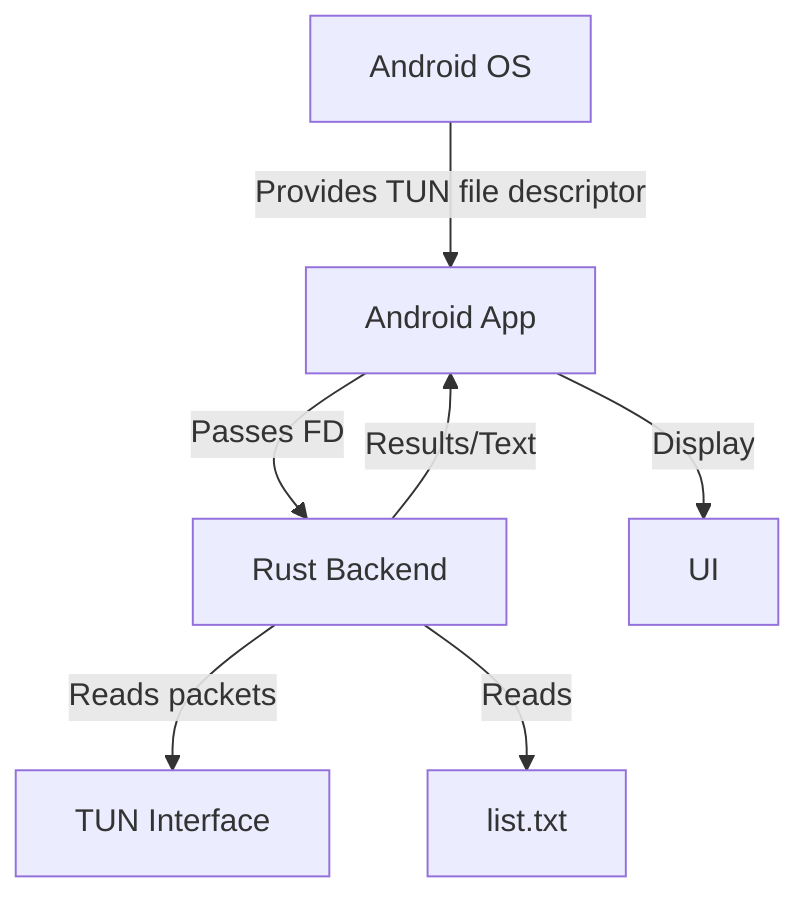

## About
**[Click here](https://github.com/ProstheticDOS/packet_sniffer) to view the current version (highly recommended)**
This project explores how Android VPN-based packet capture works. It creates a userspace VPN using Android's [VpnService](https://developer.android.com/reference/android/net/VpnService) API, captures packets through a [TUN](https://www.baeldung.com/linux/tun-interface-purpose) interface, parses unencrypted DNS traffic (UDP/53), and compares queried domains against a user-provided list.

## Technical Details

- Android VpnService API creates a userspace VPN and exposes a TUN interface.
- The TUN file descriptor is passed from Java to Rust through JNI.
- Rust reads raw IP packets directly from the TUN device.
- UDP packets on port 53 are parsed as DNS messages.
- Queried domains are matched against a user-provided list.
- `memmap2` is used to memory-map the list file for efficient lookups.
- It uses [`memmap2`](https://crates.io/crates/memmap2) for zero-copy reading the list.

## Architecture
Here's a simple diagram to explain how the data flows 

## Screenshots

## Limitations

- The VPN configuration is currently restricted to a single target application for testing purposes.
- Only supports plaintext DNS over UDP port 53.
- Does not inspect DNS-over-HTTPS (DoH).
- Does not inspect DNS-over-TLS (DoT).
- Packets are inspected but not forwarded back to the network stack, so network traffic is effectively dropped after capture.
- Error handling is minimal and intended primarily for debugging.
- Lots of dead code for debugging purposes (manual debugging)
- No automated test suite used 
- Limited testing coverage
- Manual testing only

## Roadmap
- [x] Packet Parsing
- [x] Unencrypted DNS parsing
- [ ] Code Readability
- [ ] Forwarding packets to the internet

## Things I'd want to add if possible
- [ ] FSTs (finite state tranducers) for more efficient parsing of list.txt 

---
### Development notes
This project was developed entirely on an Android device using Neovim and a mobile Rust/Java toolchain. Testing was hard.
